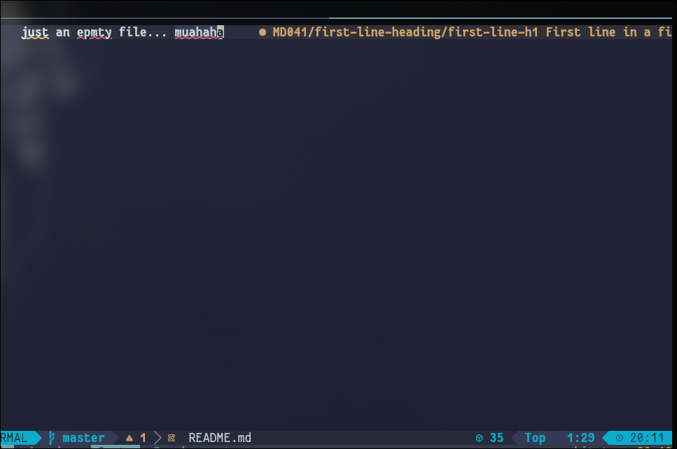

**task** There is a git repository at ssh://bandit30-git@bandit.labs.overthewire.org/home/bandit30-git/repo via the port 2220. The password for the user bandit30-git is the same as for the user bandit30.

- clone the repo

```
git clone ssh://bandit30-git@bandit.labs.overthewire.org:2220/home/bandit30-git/rep
```

- hmm you aren't supposed to `muhaha` when you've got the spelling of _empty_ wrong. <br>
  ......... embarrassing <br><br>
  fig: readme.md from the cloned respo



- Look up tags and you'll find the answer
