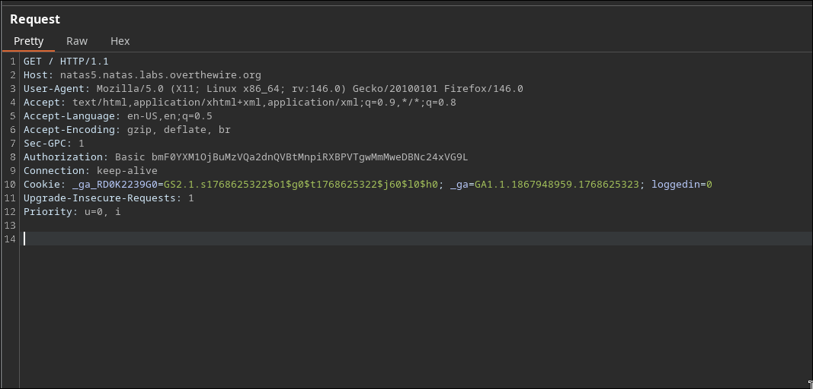

- the landing page for this level has " Access disallowed. You are not logged in"
- assuming yk what burp does. tldr: It's used as a proxy server to intercept and modify requests

- look at what burp does. takes an hour hardly

- Let's intercept the request and examine it.
  

- the `logged_in` cookie is set to 0. Let's try making it 1 and then forward it

- gotit

